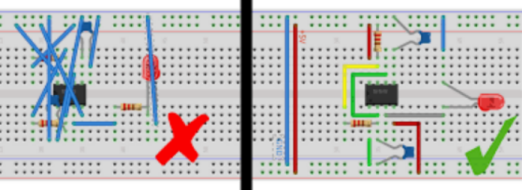
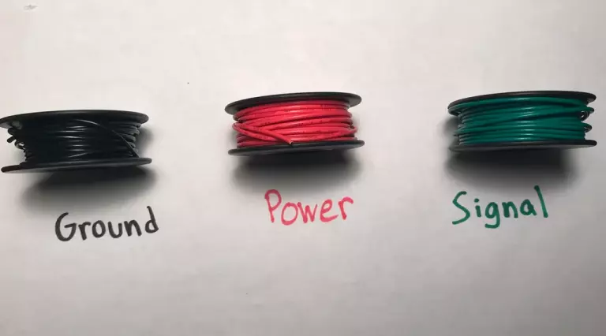

# Class-Instructions

Instructions for each checkpoint/deliverable in this class, as well as helpful setup/configuration instructions. Below are the design parameters for your XY Plotter, as well as some rules for the class.

## Project Specifications

Your objective this semester is to take an existing XY Plotter, deconstruct it, and reimplement it (along with some additional functionality) using a Raspberry Pi 4 and it's necessary accompanying hardware. 

As covered later, you'll be using Python to program, and two Raspberry Pi "Hats" which add Stepper Motor control for the X and Y stepper motors, and an LCD display. In addition to the hats, you'll also be using two digital encoders for input/controls and an H-Bridge chip to drive the Z axis stepper motor.

In addition to recreating the functionality of the original XY Plotter (X, Y, Z axis control) you will also be implementing three "Operating Modes" and an interactive menu system on the LCD display to select them as well as other operations such as calibration, homing, etc. These "Operating Modes" include an Equation Drawer, an Etch-A-Sketch mode, and a G-Code mode, parameter for which exist below.

### Equation Drawer (TODO)

<!---
TODO:

Collect and finalize tight specification around the functionality of the equation drawing mode such as:

    * What kinds of functions/equations need to be supported? (polynomials, quadratics, etc.)

    * What are the parameters around scaling on the plotter? Fix scale? Parameters around a dynamic        scaling system?
    
    * What are the accuracy requirements?

    * How would they give their code equations to draw?

    * Should they essentially make a G-Code generator for equations, and use the G-Code mode? 

--->

### Etch-A-Sketch

For the Etch-A-Sketch mode, your goal is fairly simple: recreate the functionality of the popular kids toy! You'll use the two digital encoders provided to control the X and Y axis to create a "manual" drawing mode.

When spinning the encoder knobs clockwise, the X-axis should move "right" relative to its home position and the Y-axis should move "up" relative to its home position. Conversely, when spinning the encoder knobs counter-clockwise, the X-axis should move "left" relative to its home, and the Y-axis should move "down" relative to its home.

The mode should include the ability to adjust any necessary parameters such as motor step size, speed, etc. The LCD display has 5 GPIO buttons that can be used for this purpose.

The mode should also include the ability to toggle the Z-axis (the pen holder) in an "up" and "down" position.The digital encoders come with extra GPIO output for a "short" and "long" press that could be used here.

For your safety as well as the safety of the equipment, you should make sure the motors stop when encountering the X and Y endstop switches and when it has reached the opposite end of its gantry. In essence, make sure the motors do not attempt to go where they can't.

### G-Code (TODO)

<!---
TODO:

Identify subset of G-Code needed for the XY Plotter:

    * Complexity of the instruction set should be dictated by the needs of the equation drawer and the instructions needed for our sample G-Code input.
--->

### LCD/Encoder Interface

Finally, you should create a User Interface using the provided 2x16 LCD display and digital encoders. The interface should provide access to and facilitate the use of each of the operating modes, as well as provide and accept any other configuration information or calibration options/operations.

Use the [interface on the Prusa i3 3D printer](https://help.prusa3d.com/en/article/lcd-menu-original-prusa-i3_142322) as inspiration.

## Rules (TODO)

Below is a set of rules to follow while working on this project in addition to any established on the syllabus. These are generally best practices for keeping your project organized and on track.

### Breadboard Wiring

When wiring up components with a breadboard it is crucial that your wires stay organized and distinguishable. If you don’t follow these practices, you’re likely to screw up the wiring for your XY Plotter often, which not only leads to frustration and wasted time, but could also be fatal for your more sensitive components such as the H-Bridge chip or the Raspberry Pi. If you follow these steps, you will be well on your way to avoiding the most common pitfalls:

1. ### Use Clean Wiring

    

    Keep your wiring clean. Avoid excessively long wires which make it impossible to trace if there is a problem and are more prone to pull out. You can either purchase wires that are pre-cut to different lengths or make them yourself.

2. ### Use Color Coding

    

    Another tip is to organize your wires so that the color matches the circuit's electrical property. This will help you identify what types of wires are which when troubleshooting your breadboard circuits. The most common wire color coding is that all POWER wires should be RED, and all GROUND wires should be BLACK.

    As you get more advanced, you can have different colors representing different voltage levels and functions. For example you can add a separate color for digital signals with 5V logic, and another for 3.3V.

    For analog circuits, you may want to have a specific color for an amplifier input or output, and yet another color to identify an ADC input.

    Besides organization, this will really help you spot mis-wirings before you apply power and potentially damage your hardware. Keep a careful lookout for RED and BLACK wires connecting to the same terminal strip, as this could indicate a short.

### Cases/Housings (TODO)

### Code Style/Conventions

Your code should follow the commonly accepted code style conventions outlined in [PEP 8](https://www.python.org/dev/peps/pep-0008/) on the official Python website. In addition to the practices outlined in PEP 8, you should follow [Object-Oriented Programming](https://en.wikipedia.org/wiki/Object-oriented_programming) principles when necessary (we'll generally let you know if something needs to be a class) and avoid creating [monolithic](https://en.wikipedia.org/wiki/Monolithic_application) software; instead opt to break your software into smaller, more manageable and maintainable pieces.

### Maintaining your Group Github Repository

In order to encourage you to learn the useful skill of managing and using a Git/Github repository, we ask to keep your group repository up to date, follow the [Github Flow](https://guides.github.com/introduction/flow/) and to use Git/Github's features like [issues](https://guides.github.com/features/issues/) to your advantage! More information on Git/Github and how to learn it will be provided in the deliverable instructions.