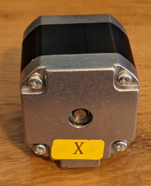
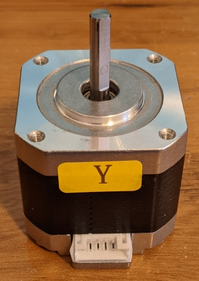

# Deliverable 4

For deliverable 4, you'll be modifying the plotter for use with the new hardware, and wiring up your Adafruit Motor Hat for use with the X and Y axis stepper motors on the Plotter. However, before you test control over the motors using software, you'll need to pass the wiring safety checkpoint and return the modified/disassembled hardware as described below.

## Wiring Safety Checkpoint for Motor Hat (P)

Before demonstrating control over two of the stepper motors on the plotter, you'll need to correctly wire the X and Y axis steppers to the Adafruit Motor Hat. After doing so, you'll need to meet with Dr. Herring, Dr. Trudgen, or one of the TAs to verify correct wiring/power delivery. Once you have passed this wiring check, you'll be given the 12V 5A power supply and breadboard adapter, as well as the 350mA stepper motors meant for use with the motor hat.

TODO: Add details about meeting times/places for wiring checkpoint.

## Modifying the Plotter for Use With the New Hardware (P)

Once you've completed the wiring safety checkpoint, you'll need to go though [this document](setup/plotter_modification.md) outlining how to modify your existing XY Plotter to be used with the Raspberry Pi and it's accompanying hardware. When you finish, take pictures of the modified sections as proof of completion. Also, make sure to set aside the following parts to return to Dr.Herring, Dr.Trudgen, or the TAs:

1. X Axis Stepper Motor

    

2. Y Axis Stepper Motor

    

## Using the Adafruit Motor Hat to Control a Stepper (D)

>***Warning: DO NOT USE the X and Y axis stepper motors that came attached with the Plotter, only use the lower-current motors we have provided you with the Adafruit Motor Hat. The motors that came with the Plotter can draw 1.6A concurrently, while the motor hat can only provide up to 1.2A concurrent per motor.***

Next, you'll need to demonstrate that you can use the Adafruit Motor Hat to control one of the 350 mA stepper motors we gave you. You may use the motor either on or off the Plotter rig itself, but make sure there are no obstructions or other mechanical issues with the Plotter rig before using the motor.

**D**: To demonstrate control over the stepper motor, create a Python script to move the motor clockwise for 1 second, and then counter-clockwise for 1 second, continuing this until the program is halted (Ctrl+C on the command-line).

For this portion, you'll be using the already installed Adafruit Python Library made for this kit/hat. [Here is great walkthrough](https://learn.adafruit.com/adafruit-dc-and-stepper-motor-hat-for-raspberry-pi/using-stepper-motors) for how to use the motor hat with the accompanying library, this goes through software and hardware setup. 

You should solder the `A0` jumper on the Motor Hat, which sets the `I2C` (the communication protocol used by the board) address to `0x61`, such that it won't conflict the the address used by the LCD display (`0x60` by default for both). This means that when you instantiate your `MotorKit` object(s), you need to add the `address` option as below:

```python
kit = MotorKit(i2c=board.I2C(),address=0x61)
```

# Summary

In summary, for this week you need to:

1. Before attempting to start the design deliverable, please complete the wiring safety and plotter modification checkpoints as outlined above. When you have completed the wiring checkpoint, we will give you the 12V 350mA stepper motors needed for the motor hat, and when you have the new motors mounted correctly to the plotter, you can begin the design deliverable.

2. Submit evidence in the form of pictures/videos for your plotter modification checkpoint to the Deliverable 4 assignment folder on ELC.

3. Submit evidence in the form of pictures/videos for your **D** deliverable item to the Deliverable 4 assignment folder on ELC. You do not need to submit code to ELC, simply ensure your group GitHub repository is up to date and contains the needed scripts.

4. Update your User Manual and Technical Documentation with your findings.

5. Submit your Weekly Project Management Report to the Deliverable 4 assignment folder on ELC.