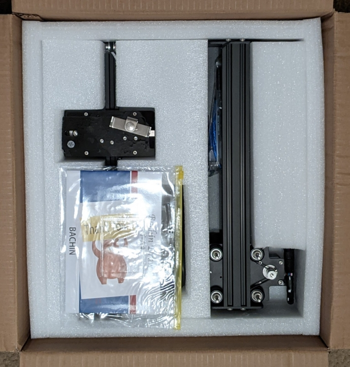
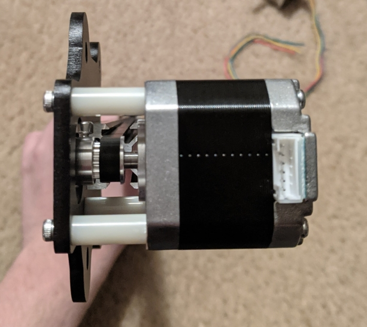
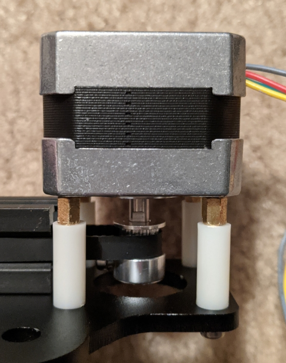
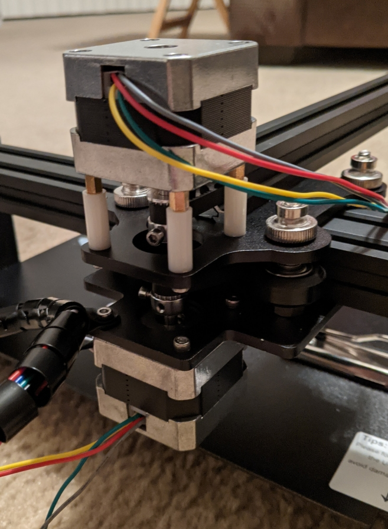

# Plotter Setup

In this section, students will assemble and use the exsisting XY Plotter provided, and modify it for use with the Raspberry Pi and its hardware.

## Assembling The Plotter

When you open up the box for your plotter, you should be greeted by something like this:

The plotter comes with the assembly itself in two pieces, a power supply, small toolkit/hardware, and a helpful quick start guide. Begin by removing the contents of the package:

Save this box and the styrofoam inserts, as it keeps the plotter organized and safe if you need to transport it.

With everything out of the package, simply follow the included instructions in the user guide to set it up. You'll need to install a Windows utility to use the plotter, so make sure to do that.

When you have the plotter assembled and the Windows Utility up and running, simply take a video of each axis moving, and use that for your submission. After you finish, uninstall the utility from your computer.

## Modifying the Plotter for use with the Pi

Next, we'll make some modifications to the plotter hardware so we can use it with the Raspberry Pi and it's accompanying hats. The stepper motors that come with the plotter draw 1.6A concurrently at 12V, which the drivers on the Adafruit Hat ***cannot*** supply. Therefore, we have also provided you with two new 12V stepper motors that draw up to 350mA concurrently which you'll need to affix to the plotter chassis.

While you're disassembling/modifying the plotter, you'll need the included allen wrenches that came with it, a pair of pliers, and some scissors/wirecutters. Make sure to save the parts/hardware you remove, and keep it organized.

Before we get to replacing the motors though, we need to disconnect the existing control hardware, leaving the power switch and pre-routed cables intact. Flip over the plotter assembly and you should see a control board much like the one pictured below:

First, disconnect the wiring harness from all of the hardware including the motors, making sure to leave the limit switches intact. Then remove the plexi-glass using the second largest allen wrench in the kit, and use the pliers to remove the standoffs and the board (save the smaller standoffs for later, we'll need them). In order to save the power switch, snip the wires as close to the board as possible. When you're done, the bottom of the plotter should look like this:

Next, we'll replace the X-axis motor. Begin by removing the X/Z gantry from the Y gantry, secured by the four thumb screws shown below:

When you've got it removed, take note of how the X-axis motor is mounted, we'll be mounting the new motor in almost the exact same way: 

Begin disassembly be loosening the toothed belt pully and the mounting screws for the motor, when you have the motor seperated from the belt pully and the gantry, position the belt pully loosely onto the new motor as below, paying careful attention to the orientation:

Next, take the smaller brass standoffs from the board mount, and screw them into the mounts on the new motor, this will solve a mounting problem caused by the new motors. After that, mount the new motor in the same way as the old, making sure to loop the belt around the pully before securing the new motor. When you have the first two screws set, adjust the position of the belt pully so that no snag or other friction occurs. When done, it should look something like this:

Now we'll replace the Y-axis motor in a simpler process. Loosen the belt pully and the mounting screws, making sure the keep the cable sleeve intact. Again, take note of the orientation and the position of the belt pully on the motor shaft:

Similarly to how we mounted X-axis motor, make sure to wrap the belt around the pully, secure the first two mounting screws, and adjust the pully height such that the belt is level with the guide pullies. Also make sure to replace the cable sleeve as it was before:

Now remount the X/Z gantry, making sure there are no conflicts/snags between the X and Y-axis motors:

After that, you're mechanical modifications are done! We recommend creating new connectors (female molex connectors) for the steppers so that you can use the existing wiring harness and generally keep your connections clean and solid. When finished, snap a picture of the modified areas for use in your deliverable submission.